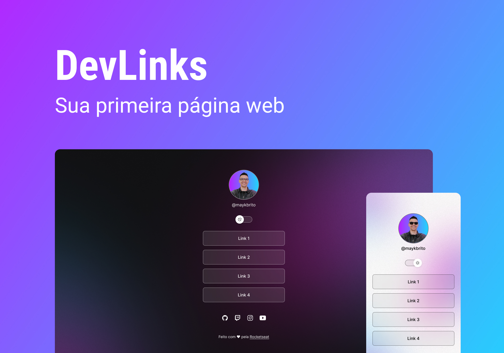

<h1 align="center"> DevLinks </h1>

Programa desenvolvido em uma vídeo aula da Rocketseat, para ensino da tecnologia WEB.  

  <a href="#-tecnologias">Tecnologias</a>&nbsp;&nbsp;&nbsp;|&nbsp;&nbsp;&nbsp;
  <a href="#-projeto">Projeto</a>&nbsp;&nbsp;&nbsp;|&nbsp;&nbsp;&nbsp;
  <a href="#-layout">Layout</a>&nbsp;&nbsp;&nbsp;&nbsp;&nbsp;&nbsp;

 

  

## 🚀 Tecnologias

Esse projeto foi desenvolvido com as seguintes tecnologias:

- HTML e CSS
- JavaScript
- Git e Github
- Figma

## 💻 Projeto

O DevLinks é um agregador de links para usar como cartao de visitar online.

- [visite o projeto online](https://maxcanoas.github.io/devlinks/)

## 🔖 Layout

Você pode visualizar o layout do projeto através [DESSE LINK](<https://www.figma.com/file/OYmMETwL2Nvd1erYQ90ON6/DevLinks-(Community)?node-id=90%3A160>). É necessário ter conta no [Figma](https://figma.com) para acessá-lo.

